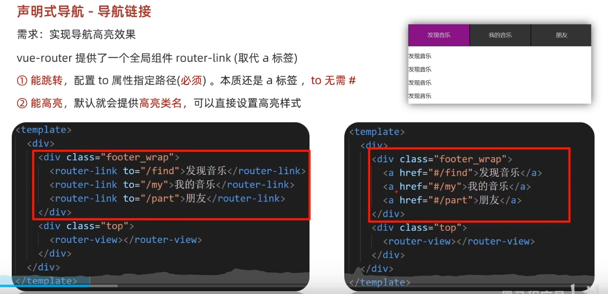

## 核心区别

### ref

* **用途** ：包装基本类型值（string, number, boolean等）
* **原理** ：创建一个包含 `.value` 属性的响应式对象
* **访问** ：需要通过 `.value` 访问实际值

### reactive

* **用途** ：包装对象或数组
* **原理** ：直接创建响应式代理对象
* **访问** ：直接访问属性，无需 `.value`

### **为什么需要 .value？**

* 基本类型值（如数字、字符串）在 JavaScript 中是不可变的
* 为了保持响应性，Vue 需要将其包装在对象中
* `.value` 是访问和修改这个包装后对象的属性

### **为什么不需要 .value？**

* 对象本身就有属性，可以直接访问
* reactive 创建的是原始对象的代理，保持相同的访问方式

# 路由

设备和ip的映射关系

## vue中的路由：路径和组件的映射关系，根据路由就能知道不同路径的，应该匹配渲染哪个组件

# VueRouter的使用（5+2）

## 1.下载：下载VueRouter模块到当前工程，版本4

```
npm install vue-router@4
```

## 2.引入 创建一个router文件夹的js文件里

```
import {createRouter}from'vue router'

//创建实例，存储路由

const routes=

[

    {path:"/", //路径

    component: ()=>import("@/views/index.vue") //组件

    },

    {

    path:"/content",

    component: ()=>import("@/views/content.vue")

    }

]

constrouter=createRouter({

    history:createWebHistory(),//选择路由模式，三种模式可选：history: createWebHistory(),      // HTML5 模式 (需要服务器配置)

//   history: createWebHashHistory(),  // Hash 模式 (默认，兼容性好)

//   history: createMemoryHistory(),   // 内存模式 (SSR/测试用)

    routes//放入路由规则

})

exportdefault router //导出
```

## 3.导入

在main.js中:

```在main.js中
import router from './router'  //导入步骤2的文件
createApp(App).use(router).mount('#app')
```

## 4.设置路由出口

```
<template>

	<router-view />

</template>
```


